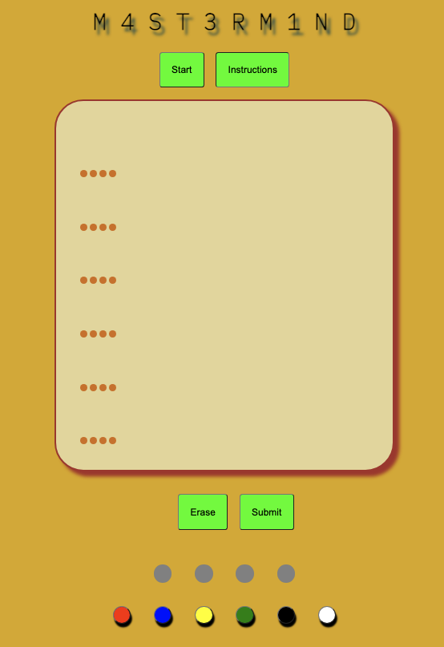
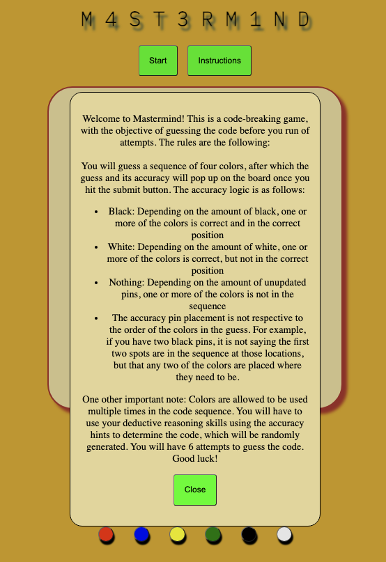
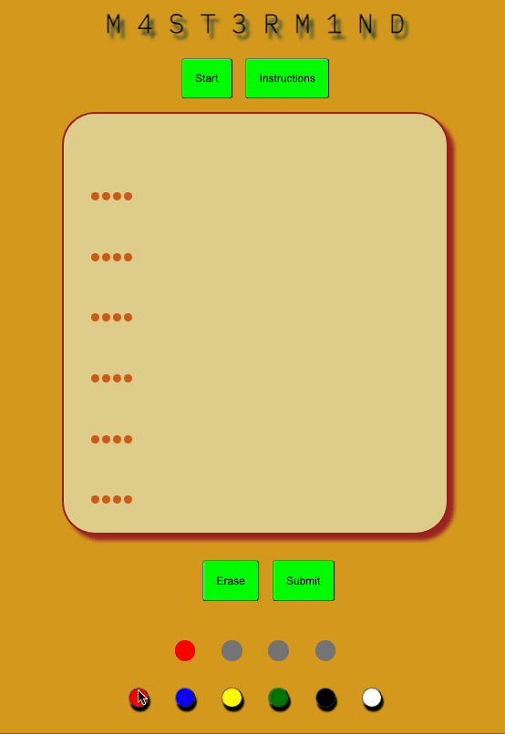
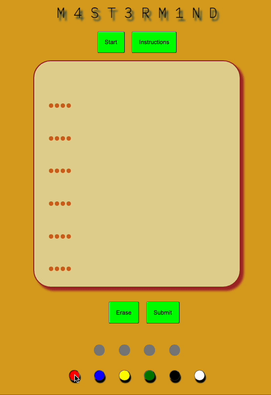
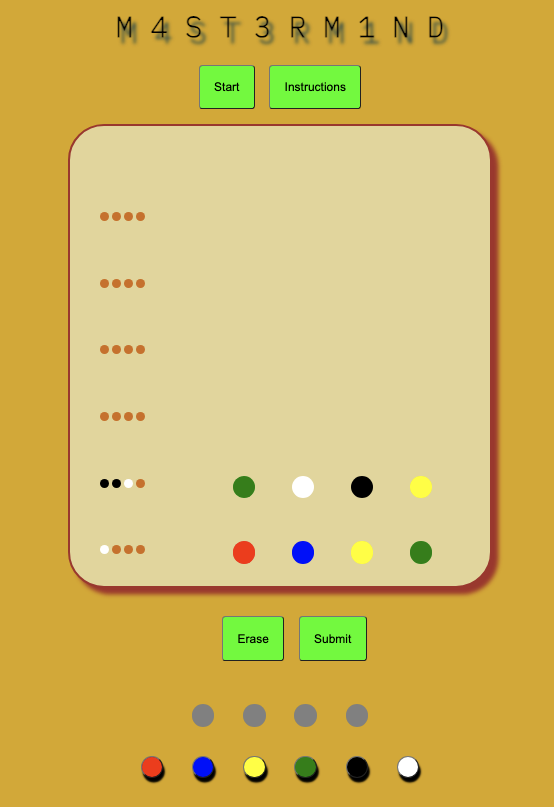
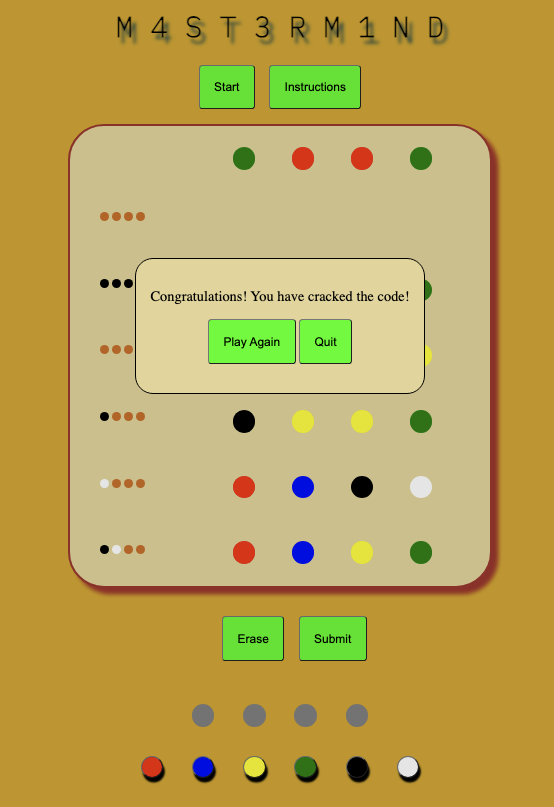
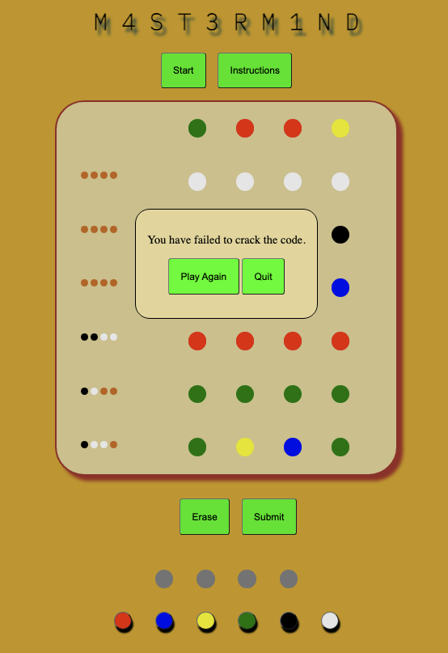

# Project-1-Mastermind-Game

## About the Game

Welcome to Mastermind! Mastermind is originally a two-player code breaking board game that was invented by a man named Mordecai Meirowitz in 1970. This rendition is a single-player version where the player is tasked with cracking a randomly generated code using their deductive reasoning skills by interpreting the hints given to them as the game progresses. The rules and gameplay loop for this game are relatively simple and are as follows:

* A random code of 4 colors is randomly generated from a selection of 6. Colors are allowed to be repeated within the code sequence.
* The player has 6 attempts to figure out the code by submitting guesses.
* After the player submits their guess, both their guess and how accurate their guess was in comparison to the code sequence will be revealed on the game board.
* The accuracy logic is as follows:
  * A black pin means a color is in the sequence and in the correct spot.
  * A white pin means a color is in the sequence but not in the correct spot.
  * No pin means a color is not in the sequence.
  * The location of the accuracy pins is not respective to the order of the guess sequence.
    * For example: If the first two slots of the accuracy check are black, that does not necessarily mean the first two colors in the guess sequence are the correct ones.

## Screenshots

Base Game Screen:\

Instructions:\

Erase Button:\

Submit Button:\

Gameplay:\

Winning Screen:\

Losing Screen:\

## Technologies Used

* HTML
* CSS
* JavaScript

## Getting Started

## Next Steps

Future implementations that are planned are:

* Including a difficulty settings option that allows for:  
  * More descriptive accuracy pins and more guesses on easier difficulties.
  * Lower the amount of guess attempts allowed and more color variety on higher difficulties.
* Let the player choose the length of the code sequence to solve for before it is generated.
* Add animations, transitions, and adjust the styling to make the gameplay more visually appealing.
