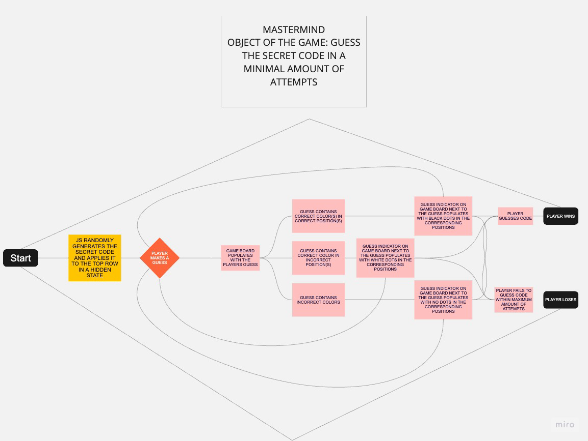
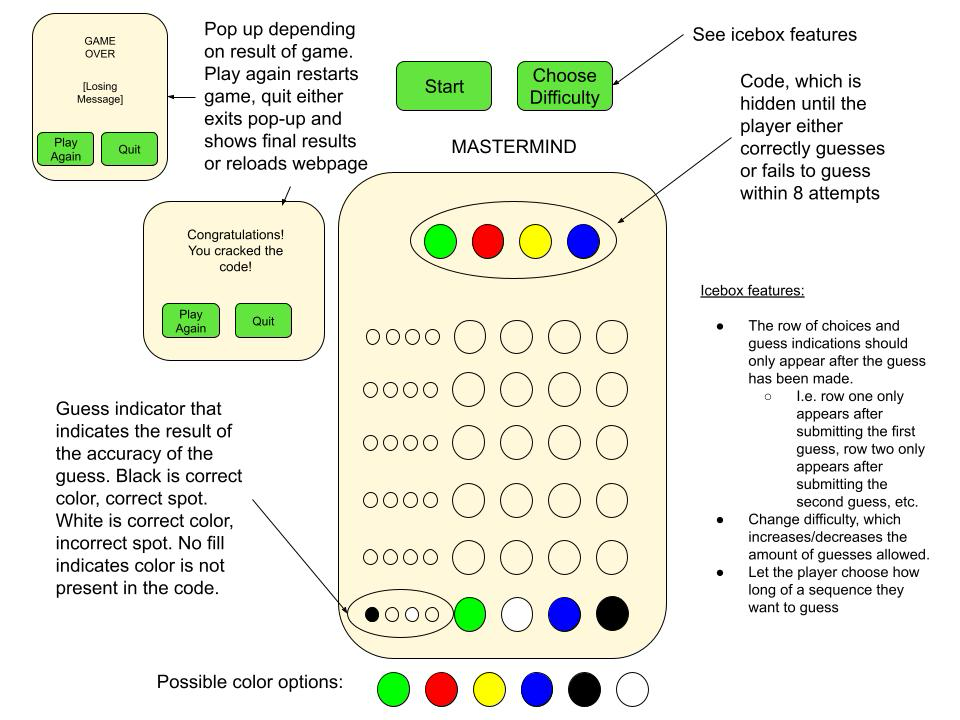

# Mastermind

## Object of the Game

    The object of the game is to have the player guess a randomly generated code of colors within a specified amount of guesses
        - Considering starting off with 6 maximum attempts
          - If I can get that working, see if I can make it dynamic by either:
            - Adding difficulty options that increase to 10 if very easy, 8 if easy, 4 if hard, 3 if very hard
            - Allowing the player to choose the amount of guesses they would like up to a maximum of 12

Rules:
    Player must make a choice of any combination of four colors from the following options:
        -Red
        -Blue
        -Yellow
        -Green
        -White
        -Black
            Colors are allowed to repeat.

    If player makes a correct guess in the correct position, the guess accuracy indicator to the side of the guess will populate with a black dot in the corresponding position.

    If the player makes a correct guess in an incorrect position, a white dot will populate in the corresponding spot of the indicator
    
    If the a color guess is wrong altogether, nothing is populated at all

    Player wins if they guess the code within the allotted amount of guesses

    Player loses if they fail to guess the code

Logic Flow: 

Wireframe: 

Pseudocode:
    1. Prompt user to start the game
        Start button
        Play Again button
        After user starts game, have a code of colors randomly generated and applied to the top row while remaining hidden
    2. Gameplay Loop
        Player selects 4 colors in the order of their guess (i.e. first clicked color corresponds to first circle in the submitted guess)
        The guess indicator section to the side of the gameboard renders with black, white, or nothing depending on if the corresponding color in the guess is part of the solution and if it is, the location of the color
            Black: correct guess, correct spot
            White: correct guess, incorrect spot
            Nothing: incorrect guess
        Player has 6 attempts to guess code
            Will try to keep rows of unused guesses hidden until they are populated, but this may end up as an icebox feature
            If they guess within the six attempts, a congratulations screen pops up
            If they fail to guess within six attempts, a game over screen pops up
                Both screens contain a 'Play Again' button and 'Quit' buttons
                    See section 1 for purpose of 'Play Again' button
                    Quit button will either: reload the page to the initial state OR exit out of the popup and show the board in its current state. Ideally the latter, but will depend on feasability
                    Game over screen should immediately pop up if all 6 guesses are used and are not correct
